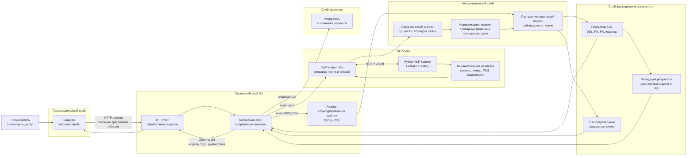
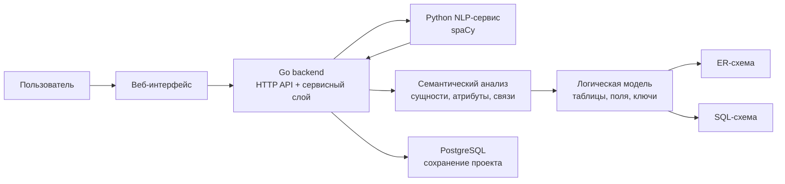

# Общая архитектура программной подсистемы

## Краткая расшифровка блоков

| Блок | Назначение |
|---|---|
| Веб-интерфейс | Ввод описания предметной области, выбор примеров, просмотр сущностей, связей, ER-схемы и SQL-кода |
| HTTP API | Прием запросов от интерфейса и возврат результата анализа |
| Сервисный слой | Определение типа входных данных, запуск NLP-анализа, анализатора, генератора SQL и валидации |
| NLP-клиент Go | Передача текста в Python-сервис, получение разметки, локальный fallback при недоступности сервиса |
| Python NLP-сервис | Токенизация, лемматизация, определение частей речи и синтаксических зависимостей через spaCy |
| Семантический анализ | Выделение сущностей, атрибутов и связей предметной области |
| Нормализация модели | Приведение терминов к единому виду, удаление служебных слов и шумовых элементов |
| Построение логической модели | Преобразование сущностей в таблицы, атрибутов в поля, связей во внешние ключи |
| Генератор SQL | Формирование SQL DDL-кода для создания структуры базы данных |
| Валидация | Проверка модели и SQL-кода, формирование диагностических сообщений |
| PostgreSQL | Опциональное сохранение исходного описания, модели, SQL-кода и диагностики |

## Упрощенная версия для слайда

